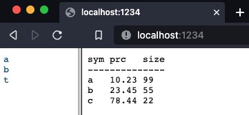
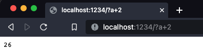
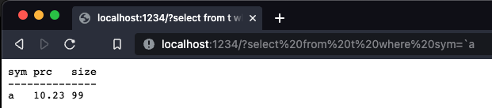
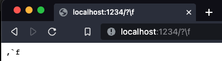
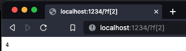

# kdb+ via browser

* lets open a q process and define port as `1234`
* and define some variables

```q
q)\p 1234
q)\p
1234i
q)a:24
q)b:9 0 8 9
q)a
24
q)b
9 0 8 9
q)t:([]sym:`a`b`c;prc: 10.23 23.45 78.44;size: 99 55 22)
q)t
sym prc   size
--------------
a   10.23 99
b   23.45 55
c   78.44 22
q)f:{x*x}
q)f
{x*x}
```
* now if we open browser with address `http://localhost:[portnumber]/`
* it will show variables list on 1 side and its value on other side



* we can execute simple commands using `?` after url
  


* tables queries can also be executed in similar manner
`http://localhost:1234/?select from t where size=22`



* functions are not displayed in browser by default but can be seen using `\function_name`



* functions can also be executed although not visible



* we can also save the data in a file - `.csv` `.txt` `.xml`
* format `http://hostname:portnumber/filename.ext?variable_name_to_be_saved`
* `http://localhost:1234/tab.csv?t` - will prompt to save table t in `.csv` format
* or we can also make query to table and result will be saved to file - `http://localhost:1234/tab.csv?select from t where size=22` - will save result into `tab.csv` file
